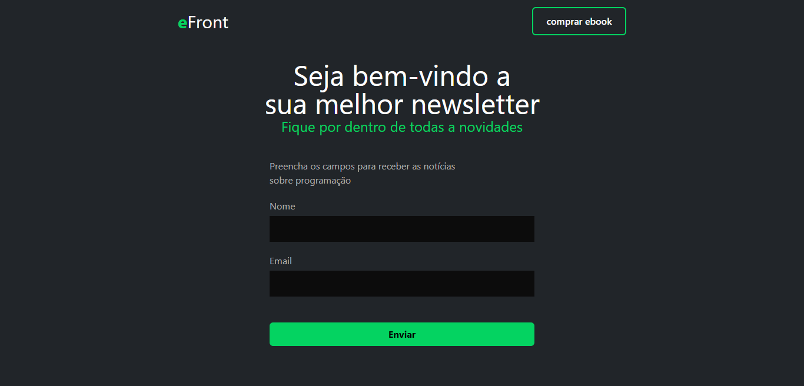

# Desafio eFront 1

# Visão Geral

O desafio consiste em uma newsletter para ficar por dentro de todas as novidades do mundo da programação. Preenchendo os campos abaixo, receba em primeira mão as últimas notícias, atualizações e informações sobre programação.

# Principais Recursos

* Captura de informações: Nosso projeto oferece uma tela de captura intuitiva, onde os usuários podem inserir facilmente as informações necessárias para receber as notícias sobre programação.

* Formulário de inscrição: Implementamos um formulário de inscrição simples e eficiente, permitindo que os usuários preencham seus nomes e endereços de email de forma rápida e conveniente.

* Interface intuitiva: Desenvolvemos uma interface intuitiva e amigável, projetada para proporcionar uma experiência agradável aos usuários durante o processo de captura de informações.

# 🛠️ Tecnologias utilizadas

# 👨‍🎓 Autor

### [Gustavo Henrique](https://github.com/byguhdev/)
